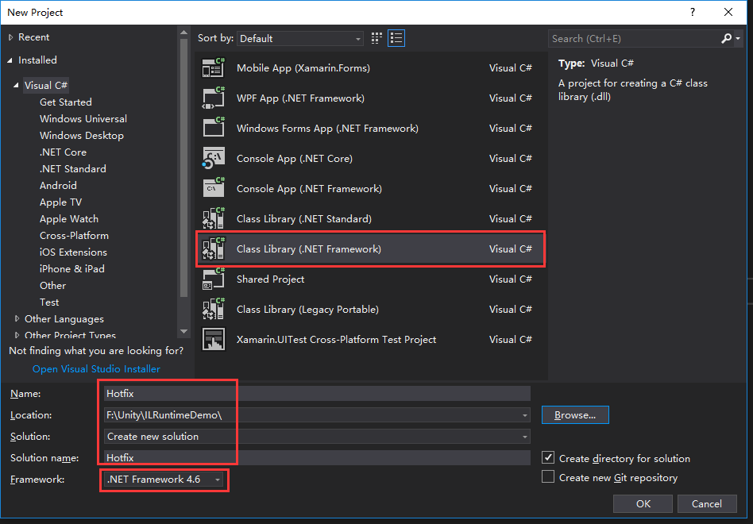

# ILRuntime 教程

**声明：本教程只是笔者在学习过程中的一些记录，用于备忘。仅供参考。**

本文主要介绍从零开始构建一个 ILRuntime 热更新工程，但是不会涉及具体的热更新流程。只做一些关键步骤的说明，以及 [ILRuntime 官网教程](https://ourpalm.github.io/ILRuntime/public/v1/guide/tutorial.html)没有说明的地方，顺便记录踩过的坑。最后还简单验证了一下 ILRuntime 的代码热更新。

## 前期准备
### 环境准备
本文所使用的工具版本：Unity 2018.3.11f1；VS 2017。

### 资源准备
[下载](https://github.com/Ourpalm/ILRuntime/releases)最新版 ILRuntime 源码和调试工具，如下图：


## 构建 Unity 项目
新建一个 Unity 项目 Client，项目文件夹放到 ILRuntimeDemo 文件夹下。然后将下载的 ILRuntime 原代码压缩包解压，并将下图中的三个文件夹拷贝到 Unity 项目的 Assets 文件夹下，同时将这些目录里面的 bin、obj、Properties 子目录和 .csproj 文件都删掉。在Assets目录里建立一个名为 csc.rsp 的文本文件，在 csc.rsp 文件中加入 -unsafe。Unity 项目目录结构如下图：


注意：在笔者使用的 Unity 版本中如果使用的是 mcs.rsp 会报警告，提示将文件名改成 csc.rsp。如果添加 csc.rsp 仍然报错的话，可以重启 Unity 试试。

## 构建 Hotfix 项目

### 新建 VS 项目 
使用 vs 2017 新建一个 Hotfix 类库项目，设置如下图：


### 新建 libs 文件夹
 添加 Unity 相关的类库到 Hotfix 项目中。在 Hotfix 项目中新建一个 libs 文件夹，如下图：


### 拷贝类库文件
将 Unity 安装目录 Unity2018311\Unity\Editor\Data\Managed 下的 UnityEngine.dll、UnityEngine.dll.mdb 和 UnityEngine.xml，以及 Unity2018311\Unity\Editor\Data\UnityExtensions\Unity\GUISystem 目录下的 UnityEngine.UI.dll、UnityEngine.UI.dll.mdb 和 UnityEngine.UI.xml 这六个文件拷贝到 libs 文件夹下。如下图：


### 添加类库
为 Hotfix 添加类库引用，将 UnityEngine.dll 和 UnityEngine.UI.dll 两个类库添加到 Hotfix 项目，并将导入的类库属性设置成不拷贝到本地。如下图：


### 修改项目属性
修改 Hotfix 项目属性，将类库输出路径改成 Unity 项目的 StreamingAssets 文件夹。如下图：


## 创建脚本
### 创建 Unity 脚本
在 Unity 项目中新建一个脚本 Main.cs，代码如下：
```csharp
using System;
using System.Collections;
using System.IO;
using UnityEngine;

public class Main : MonoBehaviour
{
    ILRuntime.Runtime.Enviorment.AppDomain appdomain;
    void Start()
    {
        StartCoroutine(LoadILRuntime());
    }

    IEnumerator LoadILRuntime()
    {
        appdomain = new ILRuntime.Runtime.Enviorment.AppDomain();
#if UNITY_ANDROID
    WWW www = new WWW(Application.streamingAssetsPath + "/Hotfix.dll");
#else
        WWW www = new WWW("file:///" + Application.streamingAssetsPath + "/Hotfix.dll");
#endif
        while (!www.isDone)
            yield return null;
        if (!string.IsNullOrEmpty(www.error))
            Debug.LogError(www.error);
        byte[] dll = www.bytes;
        www.Dispose();
#if UNITY_ANDROID
    www = new WWW(Application.streamingAssetsPath + "/Hotfix.pdb");
#else
        www = new WWW("file:///" + Application.streamingAssetsPath + "/Hotfix.pdb");
#endif
        while (!www.isDone)
            yield return null;
        if (!string.IsNullOrEmpty(www.error))
            Debug.LogError(www.error);
        byte[] pdb = www.bytes;
        using (System.IO.MemoryStream fs = new MemoryStream(dll))
        {
            using (System.IO.MemoryStream p = new MemoryStream(pdb))
            {
                appdomain.LoadAssembly(fs, p, new Mono.Cecil.Pdb.PdbReaderProvider());
            }
        }
        OnILRuntimeInitialized();
    }

    void OnILRuntimeInitialized()
    {
        appdomain.Invoke("Hotfix.Game", "Initialize", null, null);
    }
}
```

### 在 Hotfix 项目中新建脚本
因为 Main.cs 脚本中 `appdomain.Invoke("Hotfix.Game", "Initialize", null, null);` 这句代码表示要调用 Hotfix 项目中 Hotfix.Game 类中的 Initialize 方法，所以 Hotfix 项目中的代码如下：
```csharp
using UnityEngine;

namespace Hotfix
{
    public class Game
    {
        public static void Initialize()
        {
            Debug.Log("Initialize ...");
        }
    }
}
```

## 编译运行
编译 Hotfix 项目，在 Unity 的 StreamingAssets 目录下会生成对应的 DLL。然后运行 Unity 就能在控制台看到打印了。

## ILRuntime 调试
官网介绍的使用方法如下：
- 安装ILRuntime调试插件，并重新启动 VS2015 或 VS2017
- 运行Unity工程，并保证执行过 `appdomain.DebugService.StartDebugService(56000);` 来启动调试服务器
- 用 VisualStudio 打开热更 DLL 项目
- 点击菜单中的 Debug->Attach to ILRuntime 按钮
- 在弹出来的窗口中填入被调试的主机的 IP 地址以及调试服务器的端口
- 点击 Attach 按钮后，即可像 UnityVS 一样下断点调试

### 调试注意事项
1. 要在 Unity 项目的代码里面加入 `appdomain.DebugService.StartDebugService(56000);` 代码，表示启动调试服务器。代码位置如下：

2. 调试前需要先运行 Unity 这样才能启动调试服务器。然后在 VS 菜单中点击 Debug->Attach to ILRuntime，按照官网的步骤操作即可。

## 热更新验证
### 制作 UI 预制体
1. 创建一个 Button，并将 Canvas 重命名为 UIRoot，如下图：

2. 在 Main.cs 脚本中添加 OnBtnClick() 方法的代码，将 Button 的点击时间绑定到 Main.cs 脚本的 OnBtnClick() 方法，代码如下：
```csharp
public void OnBtnClick()
{
    // 调用热更项目 Hotfix.Game 类中的 ClickBtn 方法
    appdomain.Invoke("Hotfix.Game", "ClickBtn", null, null);
}
```
3. 创建一个 UI 预制体。如下图：  

4. 在预制体上挂一个 BaseUI 的脚本，脚本代码如下：
```csharp
using UnityEngine;
using UnityEngine.UI;

public class BaseUI : MonoBehaviour
{
    public Image img;
    public Button btn;
    public Text text;
}
```
5. 给脚本变量赋值，如下：  

6. 将预制体保存在 Resources 文件夹下。

### 热更代码
1. 因为 Hotfix 要访问 Unity 项目中的 BaseUI 类，所以需要添加类库引用，类库位置和设置如下图：


2. 在 Hotfix 项目中添加 UI 的逻辑代码，新建 UILogic.cs 类。代码如下：
```csharp
namespace Hotfix
{
    public class UILogic
    {
        public UILogic(BaseUI ui)
        {
            ui.btn.onClick.AddListener(() => 
            {
                ui.text.text = "Click Button!";
            });
        }
    }
}
```
3. 在 Hotfix 项目的 Game.cs 脚本中添加 ClickBtn() 方法的代码，代码如下：
```csharp
public static void ClickBtn()
{
    Debug.Log("ClickBtn ...");

    // 显示 UI
    var prefab = Resources.Load<GameObject>("UITest");
    var obj = GameObject.Instantiate(prefab);
    obj.transform.SetParent(GameObject.Find("UIRoot").transform);
    obj.transform.localPosition = Vector3.zero;
    var baseUI = obj.GetComponent<BaseUI>();
    new UILogic(baseUI);
}
```
4. 重新编译并生成 dll，然后运行 Unity，点击 显示UI 按钮，报错如下：

5. 根据报错信息的提示，拷贝报错信息中红框内的代码到 Unity 脚本 Main.cs 中。如下图：

6. 编辑器中测试不报错后，将工程导出成 PC 平台的 exe。双击导出的 exe 文件，运行正常。然后修改 Hotfix 项目中的 UILogic.cs 类中的代码，如下图：

7. 重新编译生成 dll，然后将生成的 Hotfix.dll 和 Hotfix.pdb 拷贝到导出 exe 的 ILRuntimeDemo_Data\StreamingAssets 目录下，然后再重新运行 exe，发现点击 Button 按钮后，不仅显示的文字变了，背景也变成红色的了，这样就实现了代码热更新。运行效果图如下：

